## Spring实战（第五版）学习笔记

**Could not find class**，大概率是Maven版本不行的问题！ 这个bug搞死我了...

### chapter_16
运行中的应用就像包起来的礼物，你可能想摇晃或者掂量它来猜一猜里边儿装的是什么东西，Spring Boot Actuator就提供了这个"透视"的能力。
我们能够以此来查看应用的行为，健康状况甚至能触发影响它的各种操作。

都有哪些可用的配置？源码包的日志级别？应用消耗的内存？给出的HTTP接口被调用了几次？应用本身的健康状态？
`http://localhost:8080/`actuator`访问这个可以查看暴露出来的可以访问的Actuator接口

- `/health`
获取应用的健康状态，可以通过配置来展现应用健康状态的细节。
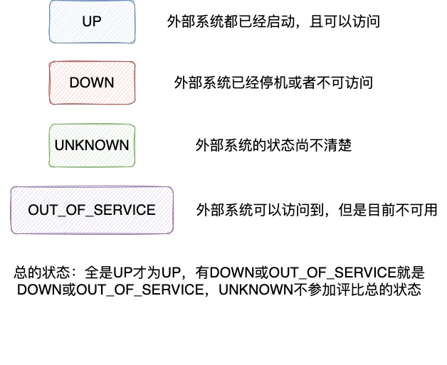

- `/beans`查看应用中的所有bean
- `/conditions`可以查看自动装配都干了啥...
- `/env`查看很多环境属性
- `/mappings`一站式的查看所有公开出来的HTTP请求，不管是自己定义的还是Actuator还是其他的，都能看到
- `loggers`这个可以查看所有应用的日志隔离级别，configuredLevel表示配置的隔离级别，effectiveLevel是生效的
`http://localhost:8080/actuator/loggers/tacos.repository.mapper.OrderMapper` 添加上包名后，可以查看对应包的日志等级

还可以通过发POST请求来更改日志级别

结果如下

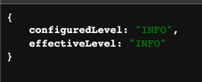

- `/heapdump`下载应用的dump文件，以此来追踪内存和线程的问题
- `/threaddump`生成一个当前线程的快照
- `/metrics`能够查看应用程序中所生成的各种度量指标，包括内存、处理器、垃圾回收、HTTP请求等

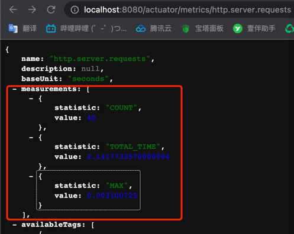

来细细的看一下HTTP请求的指标信息，其中measurements包含了请求数量，这些请求的总耗时，以及最大的耗时。

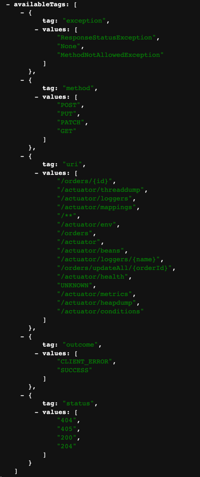

这个availableTags是更细化的内容，包括所有请求的方式，异常，uri和状态等

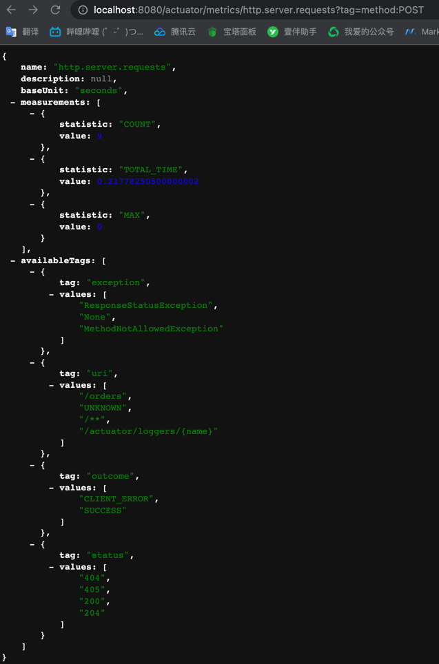

我们还可以指定后边儿的参数来查看POST请求的信息，还是挺好用的

---

自定义Info Actuator

- 可以实现InfoContributor接口，往里边儿想加啥加啥
- 它还能展示Git和Build信息

### chapter_15

在易于出现失败的方法处声明断路器，它就像是一个更加强大的try/catch，方法调用失败后，可以绕过预期方法而调用后备方法。
在微服务中，控制延迟是一件非常重要的事情，某个执行缓慢的微服务不能拖慢整个微服务的性能，避免上游的服务产生级联延迟。

后备方法要和原方法具有**一样的签名**。当然我们的微服务要遵守维加斯规则，在微服务中发生的事情，就留在微服务中，原方法抛出的异常，可以在后备方法
中捕获，为后备方法添加一个异常的参数即可。当然也可以在后备方法上继续**追加后备方法**，但是最后一个后备方法一定是不会失败的。

声明断路器的原方法上能指定方法调用的延迟时间。 

断路器的三种状态如下

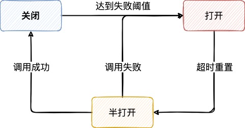

断路器的初始状态为关闭，当原方法调用失败达到一定阈值后，则会进入打开状态，在打开状态时会一直调用备用方法。
进入打开状态一定时间后， 进入半打开状态，它会尝试恢复到关闭状态，调用原方法，
如果调用原方法成功，它会认为问题已经解决，进入关闭状态，否则还会回到打开状态。

我们可以通过如下的配置在断路器声明上来指定这些参数，如下

在`(metrics.rollingStats.timeInMilliseconds)`s内，调用次数超过`(circuitBreaker.requestVolumeThreshold)`次，
且失败率超过`(circuitBreaker.errorThresholdPercentage)`，那么断路器就会进入打开状态，
断路器进入打开状态`(circuitBreaker.sleepWindowInMilliseconds)`s后，则进入半打开状态，将会再次尝试调用原始的方法，
成功则进入关闭状态，否则进入打开状态

---
Hystrix Dashboard 面板内容

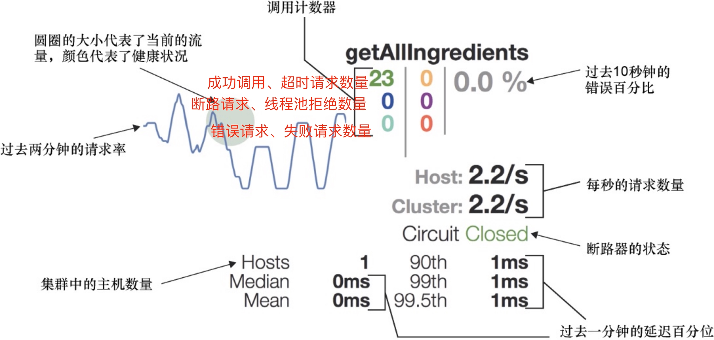

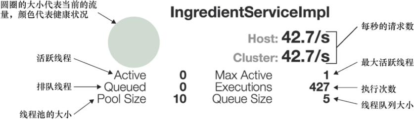

---
Hystrix Dashboard 和Actuator结合只能监控一个流，为了看多个流，我们可以使用turbine项目，它能将多个微服务的流聚合为一个在dashboard中展示

localhost:port/turbine.stream放在dashboard中即可，如下

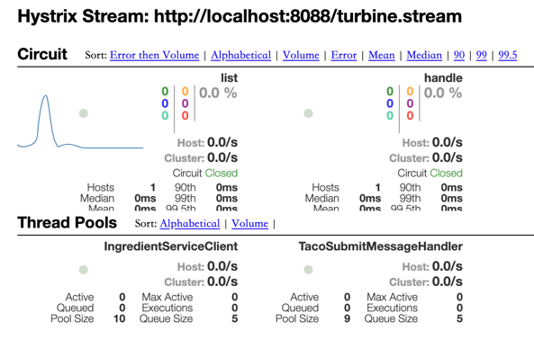

### chapter_14
Spring Cloud Config Server 为多个微服务提供中心化的配置服务。这样配置不再需要和应用程序一起打包和部署了，配置的变更或回滚不再需要重新构建
和部署应用，甚至可以在应用运行时对配置进行变更。除此之外还能共享相同的配置，而且敏感配置还能进行加密处理。

当Config Server停机时，这些配置依然是可用的，因为它们会被缓存起来。

---

当配置spring.application.name = taco-cloud时，我们把配置文件命名为taco-cloud.yaml，便会读到这个配置

当有如下配置profile时

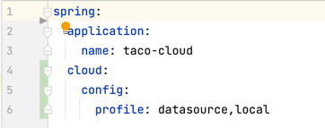

会读取`application.yaml taco-cloud-datasource.yaml taco-cloud-local.yaml` 这三个配置

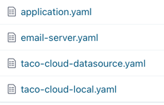

其中application.yaml是**通用配置**，各个服务间是共享的

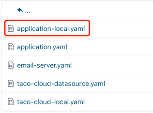

我们再添加一个application-local.yaml，因为我们配置了local的profile，可以试试它会不会读取这两个有local后缀的配置

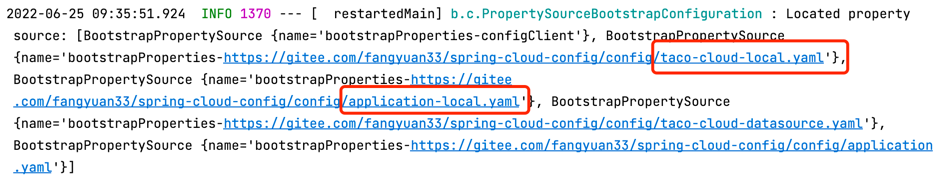

也是会的

---

- 配置的手动更新，除了要在Config Server Client微服务中添加actuator依赖之外，
还需要配置开放出actuator的访问路径，之后便可以访问/actuator/refresh更新配置了

- 配置的自动更新，原理图如下
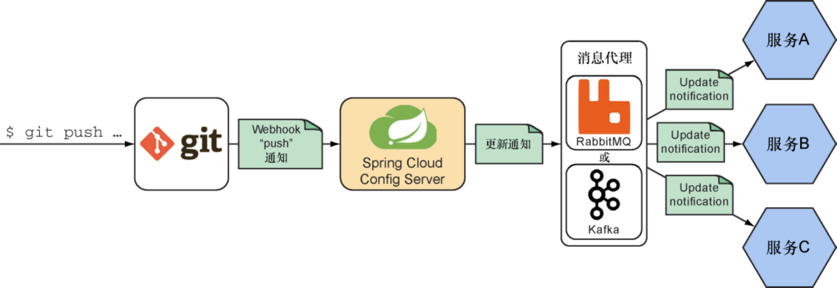

在Git仓库中配置webhook，当有push推送配置变更时，便会通知Config Server

Config Server之后会对通知做出响应，借助图中的消息代理来广播变更

每个Config Server Client应用订阅该通知，根据通知消息做出响应来刷新配置

### chapter_13
微服务架构是将应用程序分解为可独立开发和部署的小规模、微型应用的一种方式。这些微服务之间相互写作，以实现更大的应用程序的功能。
但是它也不是免费的午餐，有自己需要面临和应对的挑战，包括网络延迟，因为有很多的远程调用会累积并降低应用的速度，
另外的一个挑战是每个服务要知道它要协作的其他服务在哪里，这个问题使用**注册中心**来解决。

在微服务应用中，Eureka会担当所有服务的注册中心。Eureka本身也可以作为一个微服务，只不过它在整体中的作用是让其他的服务能够相互发现。

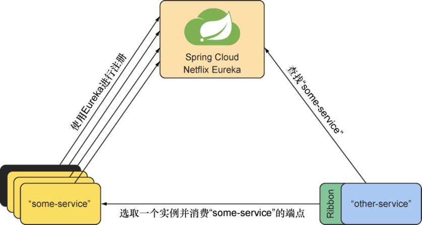

当服务启动的时候，会按照名称将自己注册到Eureka中，服务名称为`some-service`，可能存在多个等价的实例。当另一个服务`other-service`需要调用
`some-service`的服务时，会根据名字去Eureka中查找，获取到所有`some-service`的实例，之后通过**客户端负载均衡器Ribbon**来分发请求。

Eureka不喜欢孤独，当我们不经配置启动时，它会每隔30秒就抛出一些异常，这是因为它在寻找其他的Eureka服务器来建立连接，以注册自己并共享注册中心的信息。
我们可以通过配置来将其设置为不尝试与其他的Eureka服务器建立连接。

--- 

添加上对应的Eureka依赖并配置上Eureka服务的地址之后，启动起来项目那么该服务将会在Eureka中注册。

我们将端口号配置成了0，自动匹配可用的端口号，因为这个服务在被Eureka管理之后，它能知道这个服务用哪个端口，可以说是端口号自由了。

我们使用的例子是将email服务和taco-cloud服务注册，在email服务发送请求时，便不需要硬编码请求地址了。同时注意@LoadBalance的注解的作用，它能
够让RestTemplate通过Ribbon查找服务，另外的作用是声明要注入的RestTemplate支持负载均衡。

Feign调用模式还挺酷的，启用Feign之后，指定好服务名，之后像写controller层调用一样...

### chapter_12

只有当与这些控制器协作的其他组件都是非阻塞的时候，它们本身才能是非阻塞的。如果我们编写的Spring Flux控制器依赖于阻塞的repository，
那么反应式控制器需要阻塞等待它们生成数据。

MongoDB是一个基于分布式文档存储的数据库，以BSON（Binary JSON，二进制JSON）格式存储文档。

### chapter_11

传统的基于Servlet的web框架，如springMVC，其本质上是阻塞和多线程的，每个连接使用一个线程，在处理请求时，
将从线程池中提取一个工作线程来处理该请求，同时该请求处理线程被**阻塞**，直到工作线程完成为止。
因此在请求量很大的情况下，阻塞web框架不能有效地扩展。

异步的Web框架能够以较少线程达到更高地可扩展性，通常它们只需要与CPU核心数量相同的线程。

它采用的是事件轮询的机制。在事件轮询中，请求和密集型操作的回调都是以事件的形式进行处理，当需要执行请求高昂的操作时，事件轮询会为该操作注册一个
回调，这样操作可以并行执行，事件轮询会继续处理其他事件。当操作完成时，事件轮询机制会将它作为一个事件推送，这一点与请求过程是相似的。

这样异步框架就能以较少的线程数处理繁重的请求，实现更好的扩展性...

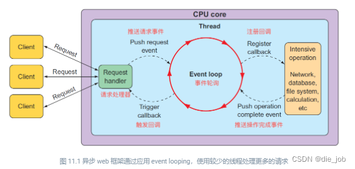

非阻塞、支持响应式流，可以运行在Netty，Undertow、Tomcat和Servlet3.1以上的web容器中。

WebFlux默认的服务器是Netty，它是一个异步、事件驱动的服务器。

---
函数式请求处理器的配置以 taco.functionConfig包下的代码为准，其中RouterFunction声明如何将请求路由到请求处理代码中

---

定义反应式的WebFlux控制器和定义Spring MVC控制器没有什么差别，它们使用的注解是一样的。
而返回值定义成Flux返回，框架它会帮我们调用subscribe()方法。

### chapter_10

反应式编程本质上是函数式和声明式的，它描述了数据将会流经的管道或流，区别于命令式编程按顺序执行任务，反应式流可以在数据可用时立即进行处理，
反应式流旨在提供**无阻塞回压的异步**流处理标准。回压是指限制想要处理的数据数量，避免过快的被数据淹没。

即使有时我们写的反应式编程仍然保持着按步骤执行的模型，但是实际上数据在处理过程中，可能在一个线程中也可能不在一个线程中，这是我们无法判断的。

---
create\buffer\log\merge\transforming的流操作以代码为准

---

Reactor原理！

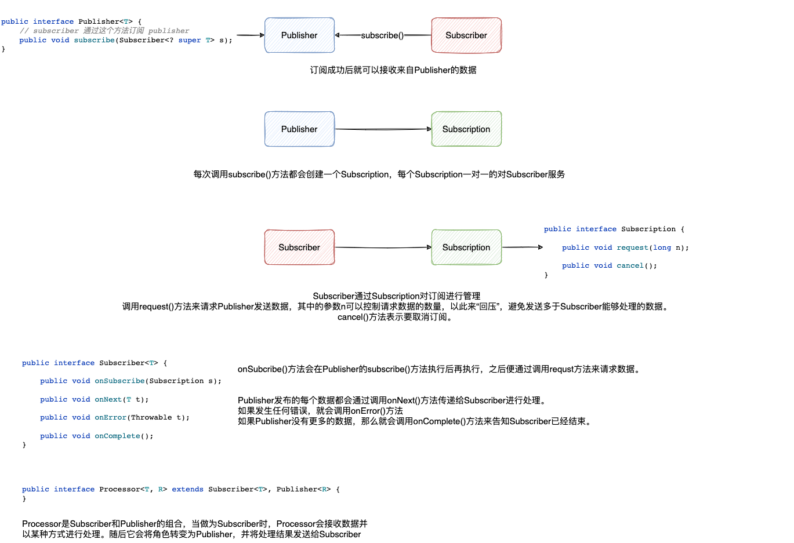
### chapter_09

Spring Integration在基于Spring的应用程序中实现轻量级消息传递，并支持通过声明适配器与外部系统集成。

它就像是一个控制系统，包括过滤、分流、转换和切分等环节功能，而这每一个环节都类似一个服务，可以是MQ，Redis，MongoDB，或者是TCP/UDP，
可以是我们系统的任何一个模块，Spring Integration就是通过它的组件将这些模块连接到一起形成一个完整的服务，实现企业系统的集成的解决方案。

---

第一个Spring Integration流程图

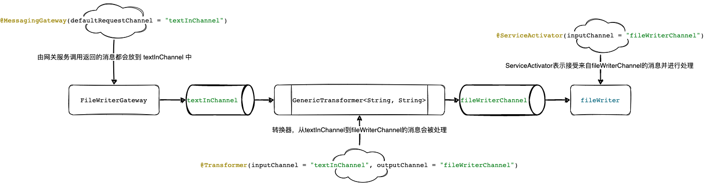

---

Spring Integration 的组件

- 通道：将消息从一个元素传递到另一个元素。默认DirectChannel: 消息只会发送至一个消费者，他会在与发送者相同的线程中调用消费者。
- 过滤器@Filter：它能够通过判断来允许或拒绝消息进入下一个流程。
- 转换器@Transformer: 它会对消息执行一些操作，可能会形成不同的消息。
- 路由器@Router: 基于判断，能够将消息进行分流。
- 切分器@Splitter: 能够切分和处理消息。
- 服务激活器@ServiceActivator: 接受来自通道的消息，并发送至一个MessageHandler进行处理，一般将其作为流程的终点。
- 网关@MessagingGateway: 它被声明为接口，通过网关应用可以提交数据到集成流中，并且`可选的`接受流的结果作为响应。相当于是接口里的一个方法，定义入参，返回值可以有也可以没有。
- 入站通道适配器@InboundChannelAdapter: 

---

maven optional标签为true时，能够避免产生重复依赖，比如A项目中有Lombok，没有添加optional标签时，B依赖A，那么B中也会有Lombok依赖

若optional为true时，此时B再依赖A，那么B中就没有Lombok可用了。optional是maven依赖jar时的一个选项，表示该依赖是可选的，不会被依赖传递。

### chapter_06

@RestController 注解会告诉Spring控制器中的所有处理器防范的返回值都要直接写入响应体中，而不是将值放到模型中并传递给一个视图以便于渲染。

@PostMapping 语义上是这对整体的更新（大规模）

@PatchMapping 语义上是对任一字段的更新

---

HATEOAS（超媒体应用状态引擎）被称为HAL超文本语言，是一种在JSON响应中嵌入超链接的简单通用格式，创建自描述API。

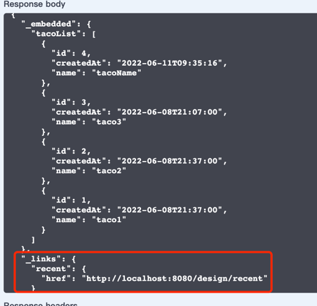

可以去看看代码里的例子

---

dependencyManagement元素提供了一种管理依赖版本号的方式。在dependencyManagement元素中声明所依赖的jar包的版本号等信息，
那么所有子项目再次引入此依赖jar包时则无需显式的列出版本号。
Maven会沿着父子层级向上寻找拥有dependencyManagement 元素的项目，然后使用它指定的版本号。

dependencyManagement中定义的只是依赖的声明，并不实现引入，因此子项目需要显式的声明需要用的依赖。

### chapter_05
如下配置虽然显式设置成了0，但是服务器并不会真的在端口0上启动，相反它会任选一个可用的端口
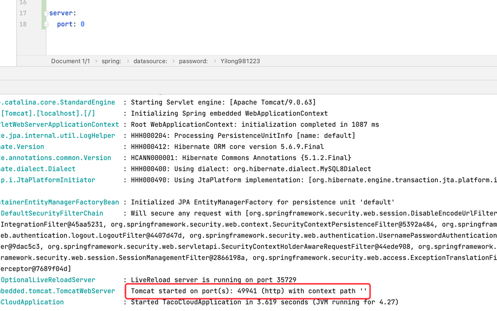

---

要设置日志级别，我们可以创建以logging.level作为前缀的属性，随后接跟着的是我们想要设置日志级别的logger
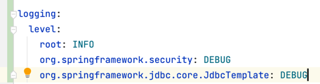

是如何设置的JdbcTemplate的logger的呢？我们点进JdbcTemplate，发现它的logger在这
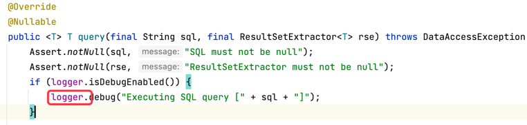

它属于它的父类

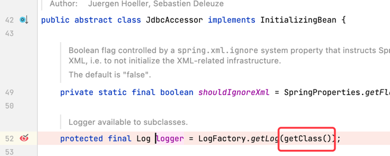

这个getClass()方法的值就是我们需要在log:level后配置的东西，如果不知道配置什么直接debug进来看

---

通过使用注解可以自定义自己的配置，如@ConfigurationProperties(prefix = "taco.design")，这个值可以随着我们的配置改变

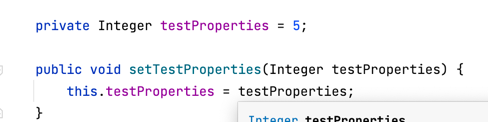
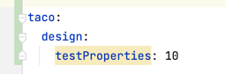

---

profile: 可以配置不同的配置文件 application-{profile名字}.yaml

之后在默认的yaml中可以配置生效的profile

还可以根据@Profile注解条件创建bean

### chapter_04

继承WebSecurityConfigurerAdapter实现自己的SpringSecurity配置，具体查看SecurityConfig类

创建User实体类实现UserDetails接口，它提供了核心的用户信息，实现UserDetailService接口，重写方法之后，将它加入配置中能自动生效

SecurityConfig中passwordEncoder()创建密码编码器的方法会生成一个bean被Spring管理起来，
每次调用该方法时都会被Spring拦截，并返回该bean实例

对于各种请求的安全配置则看SecurityConfig注释即可

csrf: 跨站请求伪造，它会让用户在恶意的web页面上填写晰晰，然后将表单数据提交到另外一个应用上，因此可能会对用户造成损失。
SpringSecurity提供了CSRF的保护，不过我们将它关闭了。

Order中为了保存userId 写了两种方式，一是通过注解在Controller层直接在请求中拿到，另一种是通过SpringSecurity上下文进行获取。

### chapter_03

http是无状态的协议，为了给它增加状态追踪，添加了cookie和Session的机制

所谓Session，指的是客户端和服务端之间的状态信息（数据）；这个状态如何界定，生命期有多长，这是应用本身的事情，Session受控与服务端
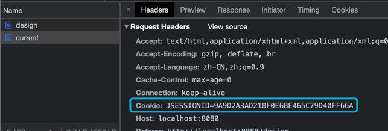
查看请求的时候可以发现SessionID

Cookie则是存储在浏览器中，记录客户端与服务端之间的状态

@SessionAttributes只能标记在类上，会将model中指定name的对象保存在Session中，可以在请求中传参和复用对象

@ModelAttribute如果标记在方法上，每次请求的时候都会执行该方法，如果有返回值则会加入到ModelMap中

如果标记在参数上，会将客户端传递过来的参数按名称注入到指定对象中，并且会将这个对象自动加入ModelMap，供view层展示

---

### chapter_02

重定向：和重定向有关的 HTTP 状态码主要是 301、302、303、307、308，最常用的是 301 和 302，可以看看 MDN 官方对它们的解释。

301 是永久重定向（Moved Permanently）说明请求的资源已经被 永久 移动到了由 Location 头部指定的 url 上，是固定的不会再改变，搜索引擎会根据该响应修正。

而 302 是暂时性转移（Moved Temporarily，或者 Found），表明请求的资源被 暂时 移动到了由 Location 头部指定的 URL 上。浏览器会重定向到这个 URL， 但是搜索引擎不会对该资源的链接进行更新。

虽然 301 和 302 都能够将用户输入的网址 A， 改为重定向后的网址 B，但他们还是有区别的：

搜索引擎区别：301 表示原地址 A 的资源已被移除，永远无法访问，搜索引擎抓内容时会将网址 A 全部替换为 B；而 302 表示网址 A 还活着，搜索引擎会在抓取网址 B 新内容的同时，保留网址 A 的记录。

安全性：302 跳转有网站劫持的风险，导致网站被盗用。

测试：code-nav.cn 可以发现下图中是301永久重定向，浏览器永久跳转到Location指定的url上。

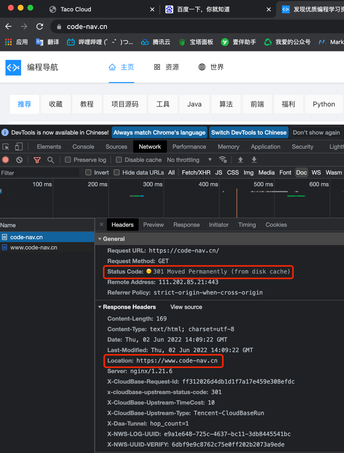

参考：[通俗讲解【重定向】及其实践](https://zhuanlan.zhihu.com/p/367927954)

---

### chapter_01

Spring的核心是提供了一个容器，通常成为Spring应用上下文，它们会创建和管理应用组件。 
这些组件也可以称为bean，将bean组装在一起的行为是通过一种基于依赖注入的模式实现的。

---

DevTools会监控变更，当它看到有变化的时候会自动重启应用，仅用于开发，在生产环境中会很智能的把自己禁用掉。

当它运行的时候，应用程序会被加载到Java虚拟机两个独立的类加载器中，一个加载Java代码、属性文件以及项目中"src/main"路径下几乎所有内容，
另外一个类加载器会加载依赖的库（这些不经常变化的东西）。
一旦它发现变化时，只会重新加载前者的内容，并重启Spring应用上下文，在这个过程中另一个加载器和JVM是不发生改变的。
这也就是它的不足之处，热部署无法反映依赖项的变化。