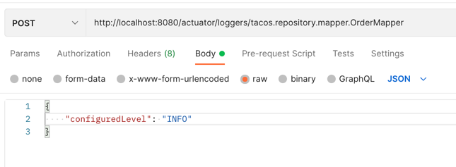

## Spring实战（第五版）学习笔记

### chapter_04

继承WebSecurityConfigurerAdapter实现自己的SpringSecurity配置，具体查看SecurityConfig类

创建User实体类实现UserDetails接口，它提供了核心的用户信息，实现UserDetailService接口，重写方法之后，将它加入配置中能自动生效

SecurityConfig中passwordEncoder()创建密码编码器的方法会生成一个bean被Spring管理起来，
每次调用该方法时都会被Spring拦截，并返回该bean实例

对于各种请求的安全配置则看SecurityConfig注释即可

csrf: 跨站请求伪造，它会让用户在恶意的web页面上填写晰晰，然后将表单数据提交到另外一个应用上，因此可能会对用户造成损失。
SpringSecurity提供了CSRF的保护，不过我们将它关闭了。

Order中为了保存userId 写了两种方式，一是通过注解在Controller层直接在请求中拿到，另一种是通过SpringSecurity上下文进行获取。

### chapter_03

http是无状态的协议，为了给它增加状态追踪，添加了cookie和Session的机制

所谓Session，指的是客户端和服务端之间的状态信息（数据）；这个状态如何界定，生命期有多长，这是应用本身的事情，Session受控与服务端

查看请求的时候可以发现SessionID

Cookie则是存储在浏览器中，记录客户端与服务端之间的状态

@SessionAttributes只能标记在类上，会将model中指定name的对象保存在Session中，可以在请求中传参和复用对象

@ModelAttribute如果标记在方法上，每次请求的时候都会执行该方法，如果有返回值则会加入到ModelMap中

如果标记在参数上，会将客户端传递过来的参数按名称注入到指定对象中，并且会将这个对象自动加入ModelMap，供view层展示

---

### chapter_02

重定向：和重定向有关的 HTTP 状态码主要是 301、302、303、307、308，最常用的是 301 和 302，可以看看 MDN 官方对它们的解释。

301 是永久重定向（Moved Permanently）说明请求的资源已经被 永久 移动到了由 Location 头部指定的 url 上，是固定的不会再改变，搜索引擎会根据该响应修正。

而 302 是暂时性转移（Moved Temporarily，或者 Found），表明请求的资源被 暂时 移动到了由 Location 头部指定的 URL 上。浏览器会重定向到这个 URL， 但是搜索引擎不会对该资源的链接进行更新。

虽然 301 和 302 都能够将用户输入的网址 A， 改为重定向后的网址 B，但他们还是有区别的：

搜索引擎区别：301 表示原地址 A 的资源已被移除，永远无法访问，搜索引擎抓内容时会将网址 A 全部替换为 B；而 302 表示网址 A 还活着，搜索引擎会在抓取网址 B 新内容的同时，保留网址 A 的记录。

安全性：302 跳转有网站劫持的风险，导致网站被盗用。

测试：code-nav.cn 可以发现下图中是301永久重定向，浏览器永久跳转到Location指定的url上。

参考：[通俗讲解【重定向】及其实践](https://zhuanlan.zhihu.com/p/367927954)

---

### chapter_01

Spring的核心是提供了一个容器，通常成为Spring应用上下文，它们会创建和管理应用组件。 
这些组件也可以称为bean，将bean组装在一起的行为是通过一种基于依赖注入的模式实现的。

---

DevTools会监控变更，当它看到有变化的时候会自动重启应用，仅用于开发，在生产环境中会很智能的把自己禁用掉。

当它运行的时候，应用程序会被加载到Java虚拟机两个独立的类加载器中，一个加载Java代码、属性文件以及项目中"src/main"路径下几乎所有内容，
另外一个类加载器会加载依赖的库（这些不经常变化的东西）。
一旦它发现变化时，只会重新加载前者的内容，并重启Spring应用上下文，在这个过程中另一个加载器和JVM是不发生改变的。
这也就是它的不足之处，热部署无法反映依赖项的变化。